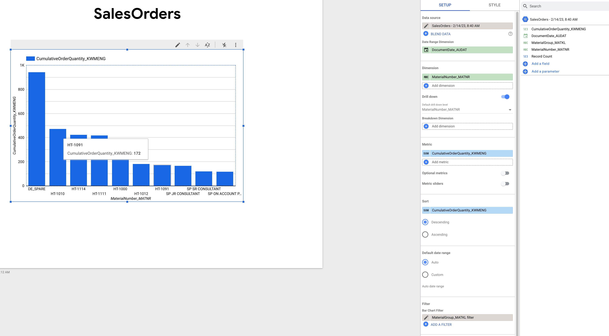

# SAP Analytics at Scale with Google Cloud Cortex Framework

## Introduction

In this hack, you’ll get the hands on experience with the Google Cloud Cortex Framework. You will review the pre-installed Cortex data foundation. After that, you will explore both the data foundation using the test data delivered with Cortex, as well as build your first Looker Studio dashboards to run the data analysis and preditions.

In the high level architecture picture, you can see the highlighted components of the Cortex framework, you will get a hands on experience with: data foundation, analytic dashboards, AI-ML models.


## Learning Objectives

This hack will help you explore the following tasks:

- Exploring Google BigQuery and essential components of the Cortex data foundation
- Building a simple dashboard using Cortex data and Looker Studio
- Exploring how you can leverage AI on top of Cortex data

The instructions are minimal, meaning that you need to figure out things :) However, we also anticipate that participants might have different level of experience with the used technical tools and different roles and goals. Therefore, the Challenges 1-4 can be explored independently from each other. Just choose the topic you are interested to explore. You can of course do all the challenges in case you have time and are willing to.

In each challenge below, you will find hints that will help you to find solutions faster. We recommend you to find the solution on your own, but feel free to use hints if you are stuck. 
  
## Challenges

- Challenge 1: Review the pre-installed Cortex Data Foundation
- Challenge 2: Let's start to explore
- Challenge 3: No dashboards, no self-service analytics
- Challenge 4: No Code AI is the best AI

## Prerequisites

- Basic knowledge of GCP
- Basic knowledge of SAP data models

## Contributors

- Viktor Palkin
- Ekaterina Kruse

## Challenge 1: Review the pre-installed Cortex Data Foundation

### Introduction
This the warm-up task, where you will explore the basics of Google BigQuery and Google Cortex Framework content using GCP console.

### Description 
From your GCP console, open the BigQuery. You will see the Cortex datasets deployed for you by us during the preparation to this lab. Take a look at the deployed datasets and corresponding tables. Can you explain the purpose of each dataset?

**Hints / solution:**

Cortex datasets overview:

  - SAP_RAW: contains the raw replicated data from SAP tables.
  - SAP_CDC_PROCESSED: contains the same set of tables but the actual records here are only the result of the processed change data records. 
  - SAP_MODELS: provides an example of how Cortex supports the usage of ML models inside of BigQuery. 
  - SAP_REPORTING: contains a powerful collection of business views that will translate the raw SAP table structure into business-language.
  - SFDC_RAW: contains the raw replicated data from Salesforce tables.
  - SFDC_CDC_PROCESSED: contains the same set of tables as SFDC_RAW but the actual records here are only the result of the processed change data records. 
  - SFDC_REPORTING: contains a powerful collection of business views that will translate the raw Salesforce table structure into business-language.

In the next task, you will explore those datasets in more details.

### Success Criteria
- You found the deployed datasets in Google BigQuery in GCP console.
- You can briefly describe the purpose of each dataset.

### Learning Resources
- [Google BigQuery documentation](https://cloud.google.com/bigquery)
- [Google Cortex Framework documentation](https://cloud.google.com/solutions/cortex)
- [Google Cortex Framework - data foundation](https://github.com/GoogleCloudPlatform/cortex-data-foundation)

## Challenge 2: Let's Start to explore

### Introduction

The objective of this challenge is to explore the data foundation deployed on the previous step. For this, we prepared a few questions for you, which you can answer using the data foundation views and the provided sample Cortex data. In case you are not familiar with SQL, you can use hints.

### Description

To explore the Cortex dataset in Google BigQuery, please, answer the following questions. For some of them, you would need to run SQL queries directly in the reporting datasets. We anticipate that you might not code in your daily job and therefore, we provide ready to use SQL statements for every question as a hint. Feel free to use them! If you have SQL experience and you have time, we encourage you to come up with the solution on your own.

Now, usign the  reporting views, please try to answer the following questions:

- **Task 1.** Find out how many different products are in the product group "002" (Electronics)

**Hint:**
Use the following query (substitute the <Project name> with the name of your own project):

  ```
  SELECT count(MaterialNumber_MATNR) FROM `<Project name>.REPORTING.MaterialsMD` where MaterialGroup_MATKL="002"
  ```

- **Task 2.** Review the view "MaterialsMD" that you used to answer the previous question. What source tables is this view built on? Tip: you can find the required information in the "Details" tab of the view.
  
**Hint:** 
Please, see the following screenshot as an example on how to find Details of a View in BigQuery: 

  
- **Task 3.** Let continue our review of the product groups Electronics. Now, please, identify the top three product from the product group "002" (Electronics) with the biggest amount of sold units in 2016.
  
 **Hint:**
Use the following query (substitute the <Project name> with the name of your own project):

  ```
  SELECT MaterialNumber_MATNR, sum(CumulativeOrderQuantity_KWMENG) as soldUnits FROM `<Project name>.REPORTING.SalesOrders` where MaterialGroup_MATKL =   "002" and Extract(YEAR from DocumentDate_AUDAT) = 2016 group by MaterialNumber_MATNR order by soldUnits desc limit 3
  ```  
- **Task 4.** Review the view "SalesOrders" that you used to answer the previous question. What source tables is this view built on? Tip: you can find the required information in the "Details" tab of the view.
  
- **Task 5.** Now, let us explore the Weather dataset. Please, find out what was the highest temperature in year 2021?

**Hint:** 
Use the following query (substitute the <Project name> with the name of your own project):

    ```
    SELECT max(MaxTemp) FROM `<Project name>.REPORTING.Weather` where extract(YEAR from WeekStartDate) = 2021
    ```

### Success Criteria

1. Your SQL statements to datasets are returning results and you can answer the formulated questions
2. You can now review the source tables that constitute COrtex reporting views

### Tips

- We recommend you to come up with your own solution to get a hands on experience with the data foundation in Cortex. 
- In case you are not familiar with SQL syntax, please, use the provided SQL statements for each question.
- To view how a view was built and which tables constitute a view, please, use the tab "Details" and scroll down to view a query.

### Learning Resources

- You can review the query syntax for Google BigQuery [here](https://cloud.google.com/bigquery/docs/reference/standard-sql/query-syntax)

## Challenge 3: No dashboards, no self-service analytics

### Introduction
In this challenge, we will explore the possibility to analyze the data using the Looker Studio. The objective of this task is to learn how to export data to Looker Studio and build simple ad-hoc dashboards.

### Description
  
First, run the following SQL query to limit the fields we want to analyze in a dashboard:
  
  ```
  SELECT CumulativeOrderQuantity_KWMENG, MaterialNumber_MATNR, MaterialGroup_MATKL, DocumentDate_AUDAT as soldUnits FROM `<Project name>.REPORTING.SalesOrders`
  ```  

Export the results of this query to Looker Studio by choosing "Explore Data" - "Explore with Looker Studio" in the "Query result" section.

**Hint:** exporting to Looker Studio
See the screenshot below for your reference. 
.

You will now immediately see some dashboards.
  
Let us explore how to modify dashboards in Looker Studio to get the required insights from the data.
1. Click on the graph showing the dependency of "Record Count" on "DocumentDate_AUDAT" and take a look at how the quiry for this dashboard was built. 
2. Please, modify this chart to see the number of sold units (CumulativeOrderQuantity_KWMENG) for each product (MaterialNumber_MATNR) for the product group "Electronics" (MaterialGroup_MATKL = 002) and for the year 2016 (DocumentDate_AUDAT is between 01.01.2016 and 31.12.2016). For that, you need to modify the "Chart setup". 

**Hint:** Changing the chart parameters
See the screenshot below for your reference. 


Which product from the product group Electronis is sold the most in 2016?

### Success Criteria
1. You are able to export the data to the Looker Studio and see the charts
2. You have modified the dashboard and identified the product which was sold most often in 2016

### Tips
In case you have time, please, try to combine the sales order data analysis with the weather dataset using Blends. Try to identify the influence of temperature on sales amounts depending on product groups.

### Learning Resources
- Looker Studio documentation is available [here](https://cloud.google.com/looker-studio)
- In case you plan to combine your sales order data with the weather dataset, please reivew [How blends work](https://support.google.com/looker-studio/answer/9061420?hl=en) in Google Cloud documentation.

## Challenge 4: No Code AI is the best AI

### Introduction


### Description


### Success Criteria


### Tips


### Learning Resources


### Learning Resources


